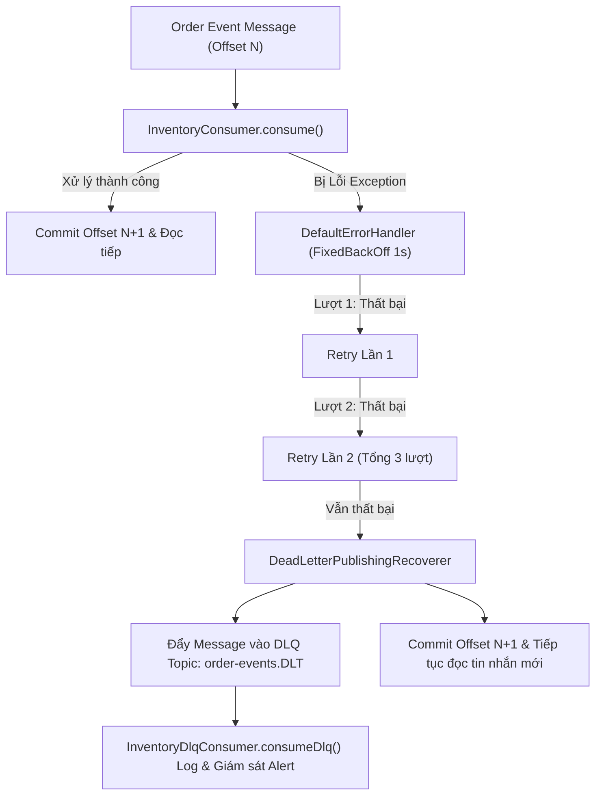

# BÁO CÁO BÀI TẬP 4: XỬ LÝ LỖI CHO KAFKA CONSUMER VỚI RETRY VÀ DEAD LETTER QUEUE (DLQ)

---

## 1. PHÂN TÍCH CƠ CHẾ KAFKA OFFSET & NGUYÊN NHÂN CONSUMER BỊ KẸT

### 📌 Cơ chế đọc Offset trong Kafka:
- Mỗi tin nhắn (message/record) gửi vào một Kafka Partition đều có một chỉ số vị trí tăng dần gọi là **Offset**.
- Kafka Consumer Group duy trì một chỉ số **Committed Offset** trên Broker để ghi nhớ tin nhắn cuối cùng đã được xử lý và commit thành công.
- Mặc định (`enable.auto.commit = true` hoặc Spring Kafka AckMode mặc định `BATCH/RECORD`), khi Consumer nhận tin nhắn tại Offset $N$, sau khi hàm `@KafkaListener` thực thi thành công không có ngoại lệ, Offset $N+1$ mới được commit lên Broker.

---

### 🔴 Nguyên nhân Consumer bị kẹt khi gặp tin nhắn hỏng (Bad Message / Corrupted JSON):
1. **Quá trình văng Exception**: Khi Consumer nhận tin nhắn hỏng (JSON thiếu dấu `}`, sai schema, dữ liệu invalid), hàm `@KafkaListener` văng ngoại lệ `Exception`.
2. **Offset không được Commit**: Do văng Exception, Spring Kafka Consumer không thể commit offset $N$ đó lên Kafka Broker.
3. **Vòng lặp lại vô tận (Infinite Retry Loop / Poison Pill)**:
   - Ở lượt poll tiếp theo, Kafka Consumer tiếp tục fetch tin nhắn tại vị trí **Current Offset chưa commit ($N$)**.
   - Consumer lại gọi hàm listener với đúng tin nhắn hỏng đó -> tiếp tục văng Exception -> lại không commit offset.
   - Hậu quả: Consumer bị **"kẹt cứng" (Blocked)** tại tin nhắn hỏng (Poison Pill Message). Hàng ngàn tin nhắn hợp lệ xếp phía sau không bao giờ được đọc tới, làm đứt gãy luồng trừ kho và trì trệ toàn bộ hệ thống.

---

## 2. NGUYÊN TẮC GIẢI QUYẾT (RETRY 3 LẦN + DEAD LETTER QUEUE)

Chúng ta triển khai bộ xử lý lỗi `DefaultErrorHandler` kết hợp với `DeadLetterPublishingRecoverer`:



### ⚙️ Các bước triển khai:
1. **Cấu hình Retry 3 lần**: Sử dụng `FixedBackOff(1000L, 2L)` (Thử 1 lần gốc + 2 lần retry = 3 lượt thử, khoảng dừng 1 giây giữa các lượt).
2. **Dead Letter Queue (DLQ / DLT)**: Sử dụng `DeadLetterPublishingRecoverer` để chuyển tin nhắn thất bại sau 3 lần retry sang Topic `order-events.DLT`.
3. **Commit Offset & Tiếp tục**: Ngay sau khi tin nhắn hỏng được đẩy sang DLT, ErrorHandler báo cho Spring Kafka commit offset và tiếp tục đọc các tin nhắn tiếp theo bình thường.
4. **DLQ Consumer (`InventoryDlqConsumer`)**: Đăng ký `@KafkaListener(topics = "order-events.DLT")` để log vết thông báo sự cố cho đội ngũ vận hành.

---

## 3. KẾT QUẢ UNIT TEST (JUnit 5 + Mockito)

Tất cả **2 Test Cases** trong `InventoryConsumerTest.java` đã chạy **PASS 100%**:

```text
InventoryConsumerTest > Test 1: Consumer xử lý tin nhắn thành công (Happy Path) PASSED
InventoryConsumerTest > Test 2: Consumer gặp dữ liệu hỏng văng Exception (Trigger Retry & DLQ) PASSED

BUILD SUCCESSFUL in 33s
```
